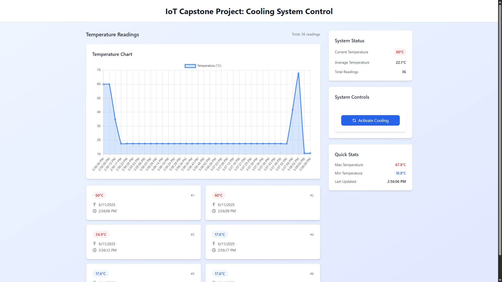

# IoT Dashboard for Temperature Monitoring with Deno Fresh

This project is a full-stack web application built with Deno and the Fresh
framework to monitor and control an IoT temperature system. The app displays
historical data, shows real-time updates, and allows remote interaction with the
physical device.

---

## Key Features

- **Data Persistence:** All temperature readings are permanently stored in a
  **Deno KV** database.
- **Historical Visualization:** On initial load, the app displays the complete
  data history through a **trend chart** and a **detailed log**.
- **Remote Control:** Includes a button to send commands to the IoT device via
  MQTT, enabling activation of actuators (A cooling system).
- **Statistics Panel:** Displays key metrics such as current, average, maximum,
  and minimum temperatures.

---

## Technologies Used

- **Web Framework:** [Fresh](https://fresh.deno.dev/)
- **Styling:** [Tailwind CSS](https://tailwindcss.com/)
- **IoT Communication:** [MQTT](https://mqtt.org/)

---

## Prerequisites

Before getting started, make sure you have the following installed and set up:

1. **Deno:** Follow the installation guide at
   [deno.land](https://deno.land/manual@v1.x/getting_started/installation).
2. **IoT Device:** A device (such as an ESP32) must be programmed and publishing
   temperature data to an MQTT broker.
3. **MQTT Broker:** Broker credentials must be configured in `.env` file.

## Getting Started

To get started, follow these steps:

1. **Clone the repository:** Clone the project repository to your local machine

2. **Install dependencies:** Run `deno task check` to install dependencies

3. **Start the application:** Run `deno task start` to start the application

4. **Access the application:** Open your web browser and navigate to
   `http://localhost:8080`

dk:w
